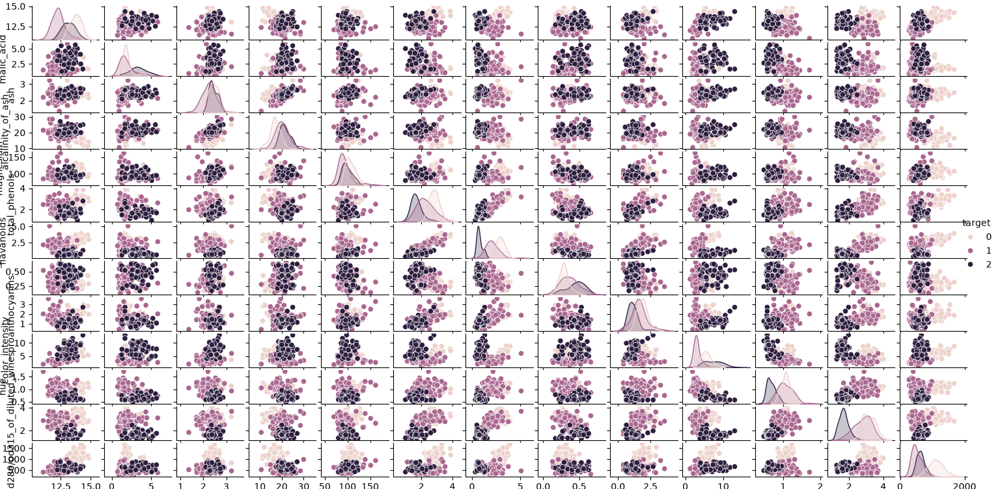

#  Wine Data Analysis

## Project Overview

This project presents an exploratory and statistical analysis of the Wine dataset from the Scikit-learn library.

The objective is to explore the characteristics of different wine classes using descriptive statistics, data visualization, and statistical hypothesis testing.

---

## Dataset

Wine dataset from the Scikit-learn library.

The dataset contains chemical characteristics of different wine classes.

---

## Technologies

- Python
- Pandas
- NumPy
- Matplotlib
- Seaborn
- Scikit-learn
- SciPy
- Statsmodels

---

## Analysis Performed

- Data loading and exploration
- Descriptive statistics
- Quartile (Q1, Q3) and IQR analysis
- Outlier detection using the IQR method
- Histograms and Boxplots
- Correlation matrix visualization
- Pairplot analysis
- One-Way ANOVA
- Alcohol level discretization
- Contingency table creation
- Chi-square test

---

## Skills Demonstrated

- Exploratory Data Analysis (EDA)
- Statistical Analysis
- Data Visualization
- Outlier Detection
- Hypothesis Testing
- Feature Engineering
- Python Programming

---

## Results

### Correlation Matrix

### Alcohol vs Target

### Scatterplots

## Files

- `Wine_Data_Analysis.ipynb` : Complete notebook containing the analysis and visualizations.

---

## Author

**Atena Maniei**

